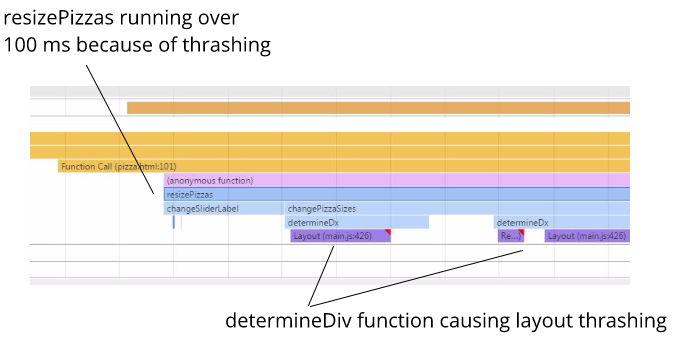

# Website Performance Optimization portfolio project

This is Project #4 of the [Udacity Front-End Web Developer Nanodegree](https://www.udacity.com/course/front-end-web-developer-nanodegree--nd001)

The goal was to optimize a provided website with a number of optimization- and
performance-related issues so that it achieves a target PageSpeed score of 90
and runs at 60 frames per second.

## Getting started
The code for the "before" website can be found [here](https://github.com/udacity/frontend-nanodegree-mobile-portfolio)

The code for the "after" website can be found [here](https://github.com/garyherd/website-optimization)

In addition, the "after" website is hosted [here](https://garyherd.github.io/website-optimization/)

To compare sites:

1. Clone each repo to your local machine:
```
git clone https://github.com/garyherd/website-optimization.git
git clone https://github.com/udacity/frontend-nanodegree-mobile-portfolio.git
```

2. Navigate to the root directory of each project and start a web server
(use different ports for each site):
```
$ python -m SimpleHTTPServer 8080
$ python -m SimpleHTTPServer 8090
```
or, for Python 3
```
$ python -m http.server 8080
$ python -m http.server 8090
```

3.  Tunnel local web servers to the internet using ngrok. Instructions are on the [ngrok site](https://ngrok.com/docs#expose)


## Requirement 1: Critical Rendering Path
Get index.html to a PageSpeed score for the mobile and desktop versions to at
least 90.

### Step 1: Profile

Using ngrok to tunnel the local web server, initial scores were
28/30 for mobile/desktop. The analysis recommended:

Should fixes:

1. Optimize images
2. Eliminate render-blocking JS and CSS in above-the-fold content

Consider fixes:

1. Leverage browser caching
2. Enable compression
3. Minify HTML

### Step 2: Optimize:

1. Optimize images: Google's PageSpeed tool provided two optimized images:
    * profilepic.jpg
    * pizzeria.jpg.
    * They were both sized and compressed. The original images file names were
    renamed with the suffix  "-lg".
2. To eliminate render-blocking JS & CSS, I made these changes:
    * used a media query on the print.css. Now, it will only request the CSS
    file if screen = print
    * added async to the Google analytics script so it doesn't block rendering
    * moved the Google Analytics script to the bottom of the body so it doesn't
    block rendering
    * replaced the Google Font CSS file request to a JS script at the bottom of
    the body, so downloading the fonts won't block rendering

### Step 3: Measure:
After above optimizations, and again using ngrok to tunnel the local web server,
PageSpeed improved to 95/96 mobile/desktop


## Requirement 2: Frame Rate
Refactor view/js/main.js such that views.html renders at a consistent 60 fps

### Step 1: Profile
The performance data generated by the views/js/main.js script itself indicates:

* Time to generate pizzas on load: 30ms
* Average scripting time to generate the last 10 frames: 2.5ms. This is
a potential problem since the whole frame must be ready every 16.6 ms to maintain
60 fps.
* When the scroll event fires, the handler calls the updatePositions function,
which is taking over 2 ms.
* You'll notice all the red ticks where the frame rate wasn't 60 fps. Here is
the screen shot:


### Step 2: Optimize:
In the original code, the updatePositions function got called for every scroll event,
so the static pizzas would get placed for every scroll event. This leads to scripting taking more
time than needed. So I moved the placement of all pizzas into the page load event handler,
which gets executed once. After removing the placement commands, the updatePositions function
served no purpose, so I disabled calls.

I also refactored the page load event handler so it generates fewer static pizzas. Fewer
elements to render means fewer elements to lay and paint. See the comments inside
the below code snippet.

```
document.addEventListener('DOMContentLoaded', function() {
  var cols = 8;
  var s = 256;

  /* pulled this out of the for loop and replaced querySelector with
    getElementById */
  var movingPizzas = document.getElementById('movingPizzas1');

  var phases = [Math.sin(0), Math.sin(1), Math.sin(2), Math.sin(3), Math.sin(4)];

  /* the original for loop went 200 times. Reduced to 40 and pizzas still fill
  the frame */
  for (var i = 0; i < 40; i++) {
    var elem = document.createElement('img');
    elem.className = 'mover';
    elem.src = "images/pizza.png";
    elem.style.height = "100px";
    elem.style.width = "73.333px";
    // elem.basicLeft = (i % cols) * s;

    // replicating static pizza placement from updatePositions function above
    elem.style.left = ((i % cols) * s) + 100 * phases[i % 5] + 'px';

    elem.style.top = (Math.floor(i / cols) * s) + 'px';

    /* moved the selector out of the loop */
    movingPizzas.appendChild(elem)
  }
  items = document.getElementsByClassName("mover");
  // updatePositions();
});
```

### Step 3: Measure:
* The scripting time is reduced from 60 ms to under 1 ms.
* No jank present during scrolling, meaning frame rate is above 60fps


## Requirement 3: Computational efficiency
Time of resize pizzas is less than 5 ms using the pizza size slider on the
```views/pizza/html``` page.

### Step 1: Profile


### Step 2: Optimize
See the comments in the code

```
  /* Eliminated the determineDx function and extracted this function */
  function sizeSwitcher (size) {
    switch(size) {
      case "1":
        return 0.25;
      case "2":
        return 0.3333;
      case "3":
        return 0.5;
      default:
        console.log("bug in sizeSwitcher");
    }
  }

  var windowWidth = document.getElementById("randomPizzas").offsetWidth;

  function changePizzaSizes(size) {
    var randomPizzas = document.getElementsByClassName("randomPizzaContainer");

    for (var i = 0; i < randomPizzas.length; i++) {
      // var dx = determineDx(randomPizzas[i], size);
      // var newwidth = (randomPizzas[i].offsetWidth + dx) + 'px';
      // var newwidth = sizeSwitcher(size) * windowWidth + 'px';
      randomPizzas[i].style.width = (sizeSwitcher(size) * windowWidth) + 'px';
    }
  }
```

### Step 3: Measure
After the improvements, the time to resize is under 3ms.

Also, it should be noted that the [Udacity forums](https://discussions.udacity.com/c/nd001-website-optimization/website-optimization-project) we very helpful when I got stuck


